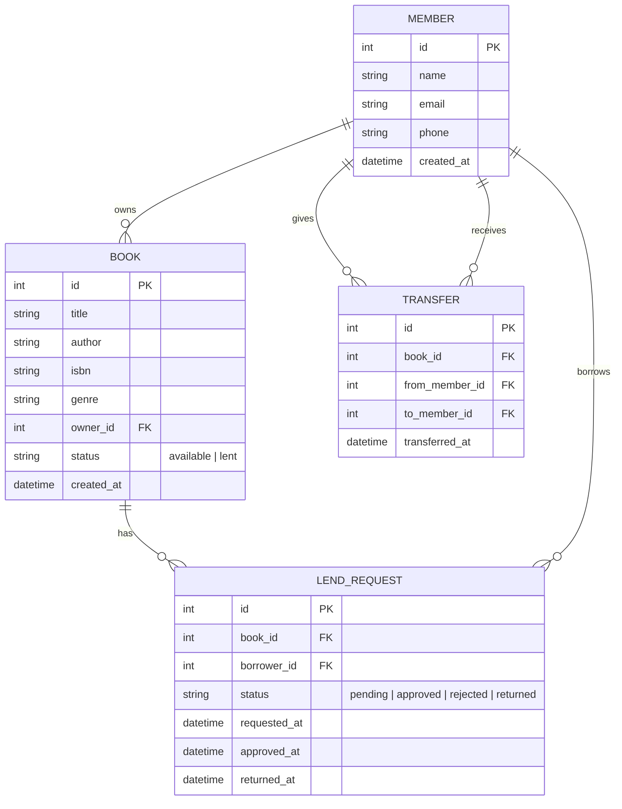

# Book Club Backend — Phased Implementation Plan

A backend API for a book club that lets members manage their personal book collections, lend books to each other, transfer ownership, and search across the club's library.

---

## Tech Stack

| Layer | Choice | Why |
|---|---|---|
| Runtime | **Node.js** | Widely known, fast to prototype |
| Framework | **Express** | Minimal, flexible HTTP framework |
| Database | **SQLite** (via `better-sqlite3`) | Zero-config, file-based — perfect for a club-sized app |
| Validation | **Joi** | Clean request validation |

---

## Data Model (ER)



---

## Phase 1 — Project Scaffolding & Database

Set up the project structure and create all database tables.

### [NEW] [package.json](file:///c:/Users/peetk/Code/Book%20Club%20App/package.json)
- Initialize with `npm init`, add dependencies: `express`, `better-sqlite3`, `joi`, `cors`, `morgan`.
- Add `nodemon` as a dev dependency for auto-reload.
- Scripts: `"start"`, `"dev"`.

### [NEW] [src/db/schema.sql](file:///c:/Users/peetk/Code/Book%20Club%20App/src/db/schema.sql)
- DDL for `members`, `books`, `lend_requests`, `transfers` tables as shown in the ER diagram above.

### [NEW] [src/db/database.js](file:///c:/Users/peetk/Code/Book%20Club%20App/src/db/database.js)
- Opens (or creates) the SQLite file, runs `schema.sql` on first launch, and exports the `db` instance.

### [NEW] [src/app.js](file:///c:/Users/peetk/Code/Book%20Club%20App/src/app.js)
- Creates the Express app, applies middleware (`cors`, `morgan`, `express.json`), mounts routers, adds a global error handler.

### [NEW] [src/server.js](file:///c:/Users/peetk/Code/Book%20Club%20App/src/server.js)
- Entry point — imports `app.js`, listens on a configurable port.

### Project structure after Phase 1
```
Book Club App/
├── package.json
├── src/
│   ├── server.js
│   ├── app.js
│   └── db/
│       ├── database.js
│       └── schema.sql
```

---

## Phase 2 — Member & Book CRUD

Core create/read/update/delete endpoints for members and their books.

### [NEW] [src/routes/members.js](file:///c:/Users/peetk/Code/Book%20Club%20App/src/routes/members.js)

| Method | Endpoint | Description |
|---|---|---|
| POST | `/api/members` | Create a new member |
| GET | `/api/members` | List all members |
| GET | `/api/members/:id` | Get a member's profile |
| PUT | `/api/members/:id` | Update member info |
| DELETE | `/api/members/:id` | Remove a member |
| GET | `/api/members/:id/books` | List a member's book collection |

### [NEW] [src/routes/books.js](file:///c:/Users/peetk/Code/Book%20Club%20App/src/routes/books.js)

| Method | Endpoint | Description |
|---|---|---|
| POST | `/api/books` | Add a book (assigned to an owner) |
| GET | `/api/books` | List all books in the club |
| GET | `/api/books/:id` | Get book details |
| PUT | `/api/books/:id` | Update book info |
| DELETE | `/api/books/:id` | Remove a book |

### [NEW] [src/middleware/validate.js](file:///c:/Users/peetk/Code/Book%20Club%20App/src/middleware/validate.js)
- Reusable Joi validation middleware factory.

---

## Phase 3 — Lending & Transfer

Workflows for borrowing and permanently giving books.

### [NEW] [src/routes/lending.js](file:///c:/Users/peetk/Code/Book%20Club%20App/src/routes/lending.js)

| Method | Endpoint | Description |
|---|---|---|
| POST | `/api/lend-requests` | A member requests to borrow a book |
| GET | `/api/lend-requests` | List requests (filterable by status / member) |
| PATCH | `/api/lend-requests/:id/approve` | Owner approves a lend request |
| PATCH | `/api/lend-requests/:id/reject` | Owner rejects a request |
| PATCH | `/api/lend-requests/:id/return` | Borrower marks book as returned |

### [NEW] [src/routes/transfers.js](file:///c:/Users/peetk/Code/Book%20Club%20App/src/routes/transfers.js)

| Method | Endpoint | Description |
|---|---|---|
| POST | `/api/transfers` | Transfer ownership of a book to another member |
| GET | `/api/transfers` | List transfer history |

---

## Phase 4 — Search & Discovery

### [NEW] [src/routes/search.js](file:///c:/Users/peetk/Code/Book%20Club%20App/src/routes/search.js)

| Method | Endpoint | Description |
|---|---|---|
| GET | `/api/search/books?q=...` | Full-text search by title, author, ISBN, genre |
| GET | `/api/search/books?owner_id=...` | Find books owned by a specific member |
| GET | `/api/search/books?status=available` | Find all books available to borrow |
| GET | `/api/search/who-has?title=...` | Check which member currently has a specific book |

---

## Verification Plan

### Automated Tests
Since this is a greenfield project, we will create a test suite in Phase 2 onwards:

1. **Unit / integration tests** using **Jest** + **supertest**:
   - Run with: `npm test`
   - Tests will live in `src/__tests__/` (e.g. `members.test.js`, `books.test.js`, `lending.test.js`, `search.test.js`).
   - Each test file uses a fresh in-memory SQLite database so tests are isolated.

2. **Smoke test after each phase** — start the server (`npm run dev`) and use `curl` or the browser to hit key endpoints.

### Manual Verification
After each phase, we will:
1. Start the server with `npm run dev`.
2. Use `curl` commands (provided in the walkthrough) to create sample members, add books, make lend requests, and run searches.
3. Verify correct HTTP status codes and JSON responses.

> [!NOTE]
> This plan intentionally **does not include authentication** — it's designed for a trusted book club. Auth can be layered on later if needed.
